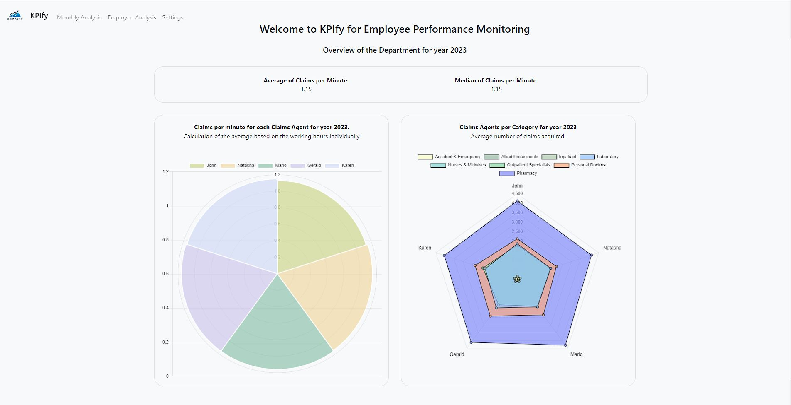
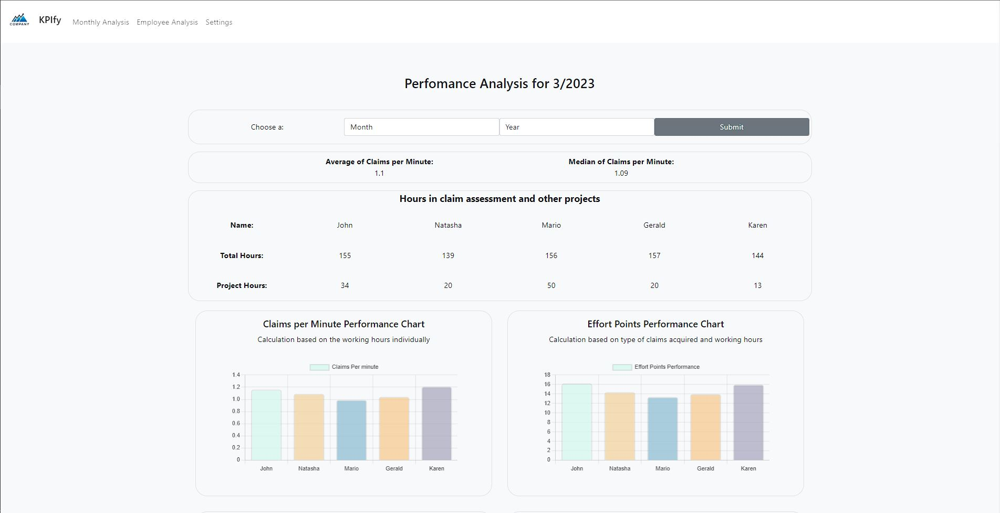
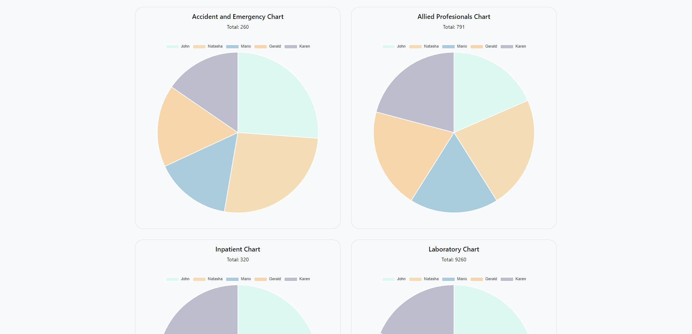
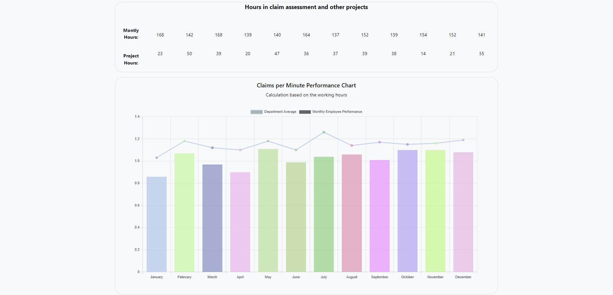
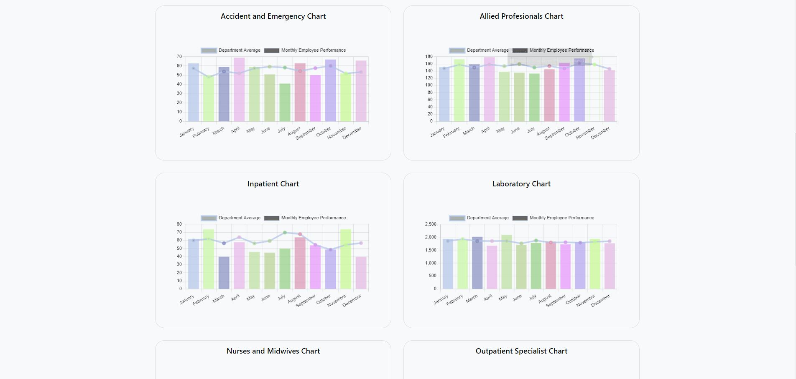

# KPIfy

### A web app to help monitor the performance of employees in a visual way.
#### **Try it on**: [Render.com](https://kpify.onrender.com/)

💡 Created using **Python**, **Flask,** **Jinja and Bootstrap**, **SQLite3**, **Javascript** and **ChartJS**.

---

## 👀 Context

> **What is this:**

KPIfy is a web application designed to help monitor the performance of employees in a visual way.
It is a useful tool for assessing employee performance, especially in departments that deal with different types of tasks with varying completion times.
The application was specifically designed for a Medical Insurance Claims department, but it can be adapted to suit other departments as well.

---

## 📄 Content

> **Index Page:**

The index page of the app provides an overview of the most important metrics for the current year.
You can view the average and median of tasks completed per minute, the average of completed tasks per minute metric for each employee, and a count of tasks completed for each category.
This page is useful for quickly assessing the overall performance of your employees.

> **Monthly Analysis Page:**

The monthly analysis page provides an in-depth analysis of each month of the current year.
You can view the average and median of tasks completed per minute for this month, tasks completed per employee per task category, and an effort points analysis based on the count and difficulty of each task category.
This page is useful for gaining insights into how your employees are performing on a monthly basis.

> **Employee Analysis Page:**

The employee analysis page provides an analysis of the performance and tasks completed by each employee for the current year.
This page is useful for assessing the performance of individual employees and identifying areas where they may need additional support or training.

> **Settings Page:**

The settings page allows you to import data (performance and working hours for each month) into the database.
You can also add new employees, deactivate them (if they no longer work with the company) or activate them again (in case of a mistake).
This page is useful for managing employee data and keeping the database up to date.

---
## 📶Analytics
KPIfy also offers a range of analytics features, including Claims per Minute, Acquired Tasks, and Effort Points.
> **Claims per Minute**
>

Claims per Minute calculates the number of acquired tasks for all different claim types and divides the hours needed in claims assessment process. This feature is useful for comparing the performance of employees, even if they have different work hours.

> **Acquired tasks**
>

Here we sum the number of tasks acquired by the employee. It is a rough representation on which tasks are more preffered by the employees, since the tasks are acquired by them.

> **Effort Points**
>

Effort Points, on the other hand, assign different effort points to different tasks, taking into account their level of difficulty. This feature is useful for assessing the impact of task difficulty on employee performance.
Since some tasks are significantly harder than other, we gave different effort point for each task. For example, more difficult tasks have a higher point. So in case an employee chooses easier tasks this will have an impact on the Effort Point Performance.

---

## 📷 Screenshots

**Index Page:**

**Monthly Analysis:**

**Per employee Analysis:**

